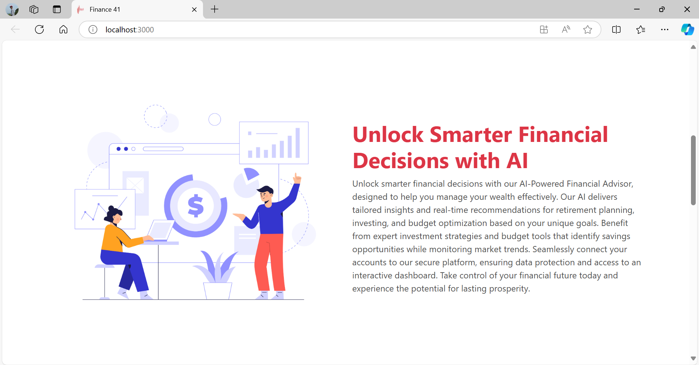

# Finance-41

Finance-41 is a financial advisor application that leverages GenAI technology to provide users with personalized insights and analytics for informed investment decisions. The application is built using React for the frontend and FastAPI for the backend, focusing on user-friendly design and robust functionality. By utilizing the Grok API with a fine-tuned model, users can receive tailored financial advice to enhance their investment strategies.

## Features
- **User Authentication:** Secure login and registration with Google SSO integration.
- **Get Financial Advice from Chatbot:** Interact with a chatbot to receive personalized financial advice.
- **Batch Jobs:** Automated process that sends users the top gainers every day at 11:00 AM to keep them informed of the best-performing stocks.
- **Portfolio Risk Analysis:** Analyze portfolio risks using advanced algorithms and the Grok API to help users mitigate potential losses.
- **Market Trends:** Fetchs and displays the realtime latest market trends.Which includes top gainers and top  losers
 - **Market News:** Stay updated with the latest financial news, with options to sort and filter news articles by latest news.
 -  **Educational Content:** Access financial education through videos and tutorials to enhance investment knowledge.
- **Industrial Search:** A comprehensive search feature that allows users to explore various industries and sectors for better investment insights.
- **Quick Contact Form:** Easily reach out for support or inquiries using a quick contact form integrated with EmailJS.
- **User Analytics:** Track user activity and display analytics.
- **Responsive Design:** Mobile-friendly layout for accessibility on various devices.
- **Performance Optimization:** Efficient data handling and rendering for a seamless user experience.

## Tech Stack

- **Frontend:** React, Bootstrap
- **Backend:** FastAPI
- **Database:** Sqlite
- **Deployment:** Docker

## Installation

### Prerequisites

- Python 3.x
- Node.js
- Dbeaver 

### Backend Setup

1. Clone the repository:
   ```bash
   git clone https://github.com/sherbinsr/Finance-41.git
   cd Finance-41
   ```
 2. Navigate to the backend directory:
    ```bash
    cd backend
    ```
3. Install required packages:
    ```bash
    pip install -r requirements.txt
    ```
4. Set up the database:
    - Create a Sqlite database and configure your database settings.
    - 
5. Download and install spaCy:
    ```bash
    python -m spacy download en_core_web_sm
    ```
6. Configure the .env file: Create a .env file in the root directory and add the following environment variables:
    ```bash
    EMAIL_USER=mailtosherbin@gmail.com
    EMAIL_PASSWORD=qzad ejdf bsbu czvd
    GROK_API_KEY=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
    RAPIDAPI_KEY=1b12ac9799msh3e65f26270ebff0p1d3954jsn6be833883c9d
    CLIENT_ID=938579478296-ligga1dbds4lc1rk751d0oaeas5ph6na.apps.googleusercontent.com
    CLIENT_SECRET=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
    ```
7. Run the FastAPI server:
    ```bash
     uvicorn app.main:app --reload
    ```
### Frontend Setup

1. Navigate to the frontend directory:
    ```bash
    cd frontend/financial-advisor
    ```
2. Install required packages:
    ```bash
    npm install
    ```
3. Run the React application:
    ```bash
    npm start
    ```
### usage
- Access the React application at http://localhost:3000.
- Access the Fastapi application at http://127.0.0.1:8000/

### Screenshots

## Home Page


## About Section 


## User Activity Section 


## AI powered Financial Chatbot


## Portfolio Risk Analysis


## Batch Jobs


## Market Trends


## Industrial Search


## Market News


## Sorting latest Market News


## Educational Resources


## ContactUs Using EmailJS


## Authentication


## Single sign on(sso-login)


### Non functional requirements

## Swagger-OpenAPI specification


## Postman


## Test Case


## Conclusion

Finance-41 aims to empower users with the tools and insights necessary for effective financial decision-making. By leveraging modern web technologies and a user-centric design, the application seeks to provide a seamless experience for individuals looking to navigate the complexities of investing. We welcome feedback and contributions to enhance the platform further. Join us on this journey to make financial knowledge accessible and actionable for everyone!

Feel free to customize sections, add more details, or remove parts as needed!
